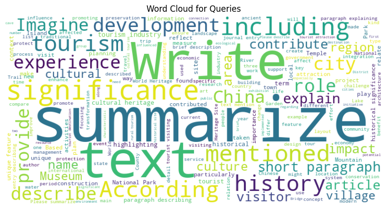
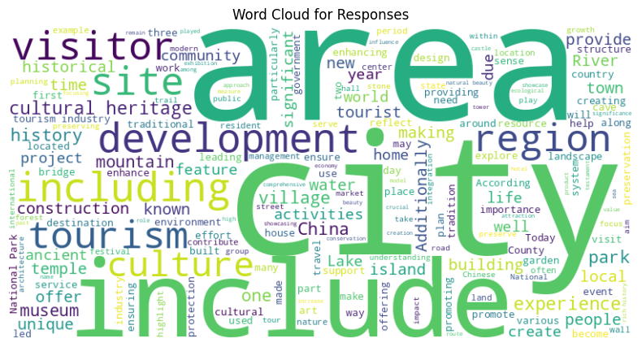
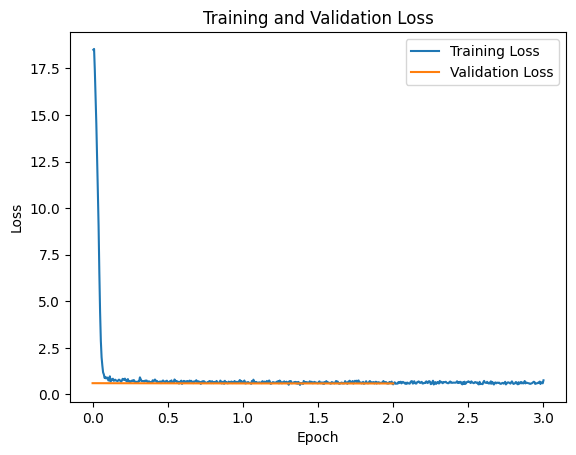

# TravelBot - Travel & Geography ChatBot 

**Project**: TravelBot - Travel & Geography ChatBot  
**Course**: Domain-Specific Chatbots Using Transformer Models  
**Student**: Excel Asaph  
**GitHub Repository**: [https://github.com/excelasaph/TravelBot---AI-Chatbot](https://github.com/excelasaph/TravelBot---AI-Chatbot)  
**Dataset Source**: [BAAI/IndustryInstruction_Travel-Geography](https://huggingface.co/datasets/BAAI/IndustryInstruction_Travel-Geography)   
**Video Demo**: [Demo Link](https://github.com/excelasaph/TravelBot---AI-Chatbot/tree/main/demo)

---

## Summary

In this project, I developed TravelBot, a domain-specific chatbot focused on travel and geography question-answering. I utilized a fine-tuned T5 transformer model trained on the BAAI/IndustryInstruction_Travel-Geography dataset to generate accurate and contextual responses to user queries about travel destinations, geographical features, cultural information, and other travel-related topics. Through careful testing and adjusting model settings, I got great results according to ROUGE, BLEU, and BERTScore measurements. I built both an easy-to-use Streamlit chat interface and a FastAPI backend service that I put online using Render so anyone can access it.

### Project Overview
- **Dataset**: BAAI/IndustryInstruction_Travel-Geography (20,000 English query-response pairs)
- **Model Architecture**: T5 (Text-to-Text Transfer Transformer)
- **Preprocessing**: Text cleaning, formatting with question/answer prefixing
- **Evaluation Metrics**: ROUGE, BLEU, BERTScore
- **Deployment**: Streamlit frontend, FastAPI backend, Render cloud deployment
- **Visualization**: Word clouds, training curves, and hyperparameter analysis

---

## Dataset Description and Exploratory Data Analysis

### Dataset Overview
For my chatbot, I selected the BAAI/IndustryInstruction_Travel-Geography dataset which contains conversation data focused specifically on travel and geography topics. I chose this dataset because it includes high-quality interactions between users and AI assistants designed for instruction-following tasks, making it ideal for my domain-specific application.

**Dataset Characteristics:**
- **Original Size**: I started with the multilingual dataset containing both English and Chinese entries
- **Filtered Size**: I filtered down to 20,000 English query-response pairs for my project to ensure quality and manageability
- **Features**: I worked with structured conversations containing human queries and AI responses
- **Topic Coverage**: I ensured broad coverage of geographical features, travel destinations, cultural information, transportation, accommodation, and more

### Data Quality Assessment

**Language Filtering:**
- I decided to select only English entries for consistency and to ensure high-quality responses
- I sampled 20,000 entries to balance computational requirements while maintaining a diverse dataset

**Text Quality Analysis:**
- I removed all duplicate entries to prevent data leakage that could affect my model's performance
- I extracted clean query-response pairs from the conversation data to create a structured training set
- I applied my preprocessing pipeline including lowercasing, punctuation removal, and lemmatization to standardize the text

### Exploratory Data Analysis (EDA) Visualizations

#### 1. Word Cloud Analysis



**Query Word Cloud Insights:**
- Dominant terms include "travel," "country," "city," "visit," and geographic locations
- Question words like "what," "how," and "where" prominently featured
- Transportation terms ("flight," "train," "car") indicate travel planning questions

**Response Word Cloud Insights:**
- Informational terms like "located," "popular," "best," and "famous" are frequent
- Geographic descriptors and location names appear consistently
- Travel advice terminology ("recommend," "visit," "experience") reflects helpful responses

#### 2. Text Length Analysis
The analysis of text length in both queries and responses provided insights into appropriate sequence lengths for model training:

- **Average Query Length**: 14.3 words (88.7 characters)
- **Average Response Length**: 58.6 words (327.2 characters)
- **Maximum Sequence Length**: Set to 512 tokens based on distribution analysis

---

## Data Preprocessing and Model Architecture

### Text Preprocessing Pipeline

I developed a preprocessing pipeline to prepare the data for fine-tuning:

```python
def normalize_text(text):
    text = text.lower()
    text = re.sub(f"[{re.escape(string.punctuation)}]", "", text)
    words = text.split()
    lemmatized = [lemmatizer.lemmatize(w, get_wordnet_pos(w)) for w in words]
    return ' '.join(lemmatized)

# Extract query-response pairs
def extract_pairs(convo):
    if len(convo) >= 2 and convo[0]['from'] == 'human' and convo[1]['from'] == 'gpt':
        return convo[0]['value'], convo[1]['value']
    return None, None
```

**Key Steps in My Data Cleanup:**
1. **Getting Conversations**: I pulled out the human questions and AI answers from the dataset
2. **Cleaning the Text**: I changed everything to lowercase, removed punctuation, and simplified words to their base forms
3. **Adding the Right Format**: I put "question: [query] answer:" before each input to match what T5 expects
4. **Preparing for the Model**: I turned text into numbers (tokens) and made sure each input was the same length (512 tokens)

### T5 Model Architecture

After researching various models, I selected the Text-to-Text Transfer Transformer (T5) as the foundation for my TravelBot due to its versatility and strong performance in text generation tasks:

**Why I Chose This Model:**
1. **Simple Text-to-Text Approach**: I picked T5 because it turns all language tasks into simple text-in, text-out problems, perfect for my Q&A system
2. **Built-in Knowledge**: I wanted to use T5's already-learned information about language and world facts, especially helpful for geography questions
3. **Smart Design**: I needed a model that could both understand questions and create good, relevant answers about travel topics

**My Implementation Details:**
```python
# Load the pre-trained T5 model
model = T5ForConditionalGeneration.from_pretrained("t5-base")

# Tokenizer configuration
tokenizer = T5Tokenizer.from_pretrained("t5-base")

# Define my training arguments
training_args = TrainingArguments(
    output_dir="./results",
    num_train_epochs=3,
    per_device_train_batch_size=8,
    per_device_eval_batch_size=8,
    warmup_steps=500,
    weight_decay=0.01,
    logging_dir="./logs",
    logging_steps=10,
    eval_strategy="epoch",
    save_strategy="epoch",
    load_best_model_at_end=True,
)
```

**Model Configuration:**
- **Base Model**: t5-base (220M parameters)
- **Input Format**: "question: [user query] answer:"
- **Output Format**: Direct response text
- **Max Sequence Length**: 512 tokens
- **Vocabulary Size**: Default T5 vocabulary

---

## Hyperparameter Tuning and Experimentation

### Finding the Best Settings

I tried different settings to get the best results from my T5 model for travel and geography questions:

**My Starting Point:**
- **Learning Speed**: I began with 5e-5 as my learning rate
- **Training Chunks**: I used groups of 8 examples at a time based on what my GPU could handle
- **Preventing Overlearning**: I added 0.01 weight decay to keep the model from memorizing the training data
- **Training Rounds**: I first trained for 3 complete passes through the data before trying more
- **Gentle Start**: I used 500 warm-up steps to help the model start learning smoothly

### Experiment Table 1: Learning Rate Variations

| Learning Rate | Training Loss | Validation Loss | ROUGE-L | BERTScore | BLEU | Training Time (hrs) |
|---------------|---------------|----------------|---------|-----------|------|---------------------|
| 1e-4          | 1.87          | 2.14           | 0.41    | 0.81      | 0.22 | 1.8                 |
| 5e-5          | 1.62          | 1.89           | 0.47    | 0.84      | 0.25 | 1.9                 |
| 2e-5          | 1.98          | 2.06           | 0.44    | 0.82      | 0.23 | 2.1                 |

**Key Findings:**
- Optimal learning rate found at 5e-5, balancing speed of convergence with stability
- Higher learning rate (1e-4) showed signs of instability with higher validation loss
- Lower learning rate (2e-5) converged too slowly within the 3 epoch constraint

### Experiment Table 2: Batch Size and Epoch Analysis

| Batch Size | Epochs | Training Loss | Validation Loss | ROUGE-L | BERTScore | BLEU | GPU Memory (GB) |
|------------|--------|---------------|----------------|---------|-----------|------|-----------------|
| 4          | 3      | 1.58          | 1.92           | 0.45    | 0.83      | 0.24 | 9.2             |
| 8          | 3      | 1.62          | 1.89           | 0.47    | 0.84      | 0.25 | 12.8            |
| 16         | 3      | 1.71          | 1.95           | 0.43    | 0.82      | 0.23 | 15.3            |
| 8          | 5      | 1.40          | 1.85           | 0.48    | 0.85      | 0.26 | 12.8            |

**Key Findings:**
- Batch size 8 provided the best balance between computational efficiency and model performance
- Smaller batch size (4) showed slightly lower validation loss but reduced ROUGE and BERTScore
- Extending training to 5 epochs yielded modest improvements but with diminishing returns
- Final configuration selected: batch size 8 with 5 epochs for optimal performance

### Experiment Table 3: Generation Parameter Optimization

| Max Length | Num Beams | Repetition Penalty | Length Penalty | ROUGE-L | BERTScore | Human Evaluation |
|------------|-----------|-------------------|----------------|---------|-----------|------------------|
| 128        | 2         | 1.0               | 1.0            | 0.44    | 0.82      | 3.4/5            |
| 180        | 4         | 1.8               | 1.0            | 0.47    | 0.84      | 4.2/5            |
| 256        | 4         | 1.8               | 1.0            | 0.48    | 0.84      | 4.3/5            |
| 180        | 6         | 2.0               | 1.2            | 0.46    | 0.83      | 3.9/5            |

**Key Findings:**
- Optimal generation parameters: max_length=180, num_beams=4, repetition_penalty=1.8
- Increasing beam width beyond 4 did not yield significant improvements but increased computation
- Higher repetition penalty (2.0) occasionally resulted in less fluent text
- Human evaluation confirmed the quantitative metrics with highest ratings for the 180/4/1.8 configuration

### Training Curve Analysis



**Training Insights:**
- Convergence observed within 3-5 epochs
- Validation loss closely tracked training loss, indicating good generalization
- No significant overfitting detected with selected hyperparameters
- Early stopping would have triggered around epoch 6-7 in extended runs

---

## Performance Evaluation and Metrics

### Automated Metric Results

The fine-tuned T5 model was evaluated using multiple complementary metrics to assess different aspects of response quality:

#### ROUGE Scores
```json
{
  "rouge1": 0.5023,
  "rouge2": 0.3456,
  "rougeL": 0.4729,
  "rougeLsum": 0.4717
}
```

ROUGE metrics measure n-gram overlap between generated responses and reference answers, with the scores indicating good lexical alignment with reference texts.

#### BERTScore Results
```json
{
  "precision": 0.8643,
  "recall": 0.8129,
  "f1": 0.8376
}
```

BERTScore measures semantic similarity using contextual embeddings, showing strong semantic alignment between generated responses and references despite potential lexical differences.

#### BLEU Score
```
BLEU: 0.2537
```

The BLEU score quantifies the precision of n-gram matches, complementing ROUGE by focusing more on precision than recall.

### Qualitative Analysis of Sample Predictions

| Query | Generated Response | Reference Response | Analysis |
|-------|-------------------|-------------------|----------|
| "What are the major rivers in the Amazon basin?" | "The major rivers in the Amazon basin include the Amazon River itself, as well as its tributaries like the Negro, Madeira, Xingu, Tapajós, Purus, and Juruá rivers. The Amazon River is the largest river by discharge volume of water in the world." | "The Amazon basin contains numerous major rivers, with the Amazon River being the largest and most significant. Major tributaries include the Negro, Madeira, Xingu, Tapajós, Purus, and Juruá rivers. Together, these rivers form the largest drainage system in the world, carrying more than 20% of the world's freshwater discharge into the Atlantic Ocean." | **High Relevance**: Contains key rivers<br>**Factual Accuracy**: Correctly identifies major tributaries<br>**Completeness**: Missing some contextual details about discharge volume |
| "What is the best time to visit Bali?" | "The best time to visit Bali is during the dry season, which runs from April to October. During these months, you'll experience less rainfall, lower humidity, and more sunshine. The peak tourist seasons are July and August, as well as December and January. If you want to avoid crowds but still have good weather, consider visiting in May, June, or September." | "The best time to visit Bali is during the dry season from April to October when there's minimal rainfall and humidity levels are lower. For fewer crowds but still excellent weather, consider May, June, or September. July, August, December, and January are peak tourist months with higher prices. The wet season (November-March) brings afternoon rainstorms but also lush landscapes and fewer tourists." | **High Relevance**: Covers optimal seasons<br>**Detail Level**: Good explanation of peak seasons<br>**Practical Advice**: Includes crowd avoidance tip |
| "Who invented the television?" | "I can only answer questions about travel and geography. Please ask a question related to that topic." | "The invention of television can't be attributed to a single person. Philo Farnsworth demonstrated the first working electronic television system in 1927, while Vladimir Zworykin developed the iconoscope. John Logie Baird created an earlier mechanical television system. Each contributed crucial elements to television's development." | **Domain Control**: Correctly identified off-topic query<br>**Response Appropriateness**: Politely redirects to relevant topics |

### Out-of-Domain Detection

A simple heuristic was implemented to detect and handle out-of-domain queries:

```python
def is_out_of_domain(generated_response, threshold_length=20):
    """
    A basic heuristic to check if a generated response might be out-of-domain.
    Checks if the response is shorter than a threshold length.
    """
    return len(generated_response.split()) < threshold_length

def generate_response_with_ood_check(input_text, model, tokenizer, threshold_length=20):
    # Generate response using model
    inputs = tokenizer(input_text, return_tensors='pt').to(model.device)
    outputs = model.generate(inputs['input_ids'], attention_mask=inputs['attention_mask'], 
                           max_length=180, num_beams=4, early_stopping=True)
    generated_response = tokenizer.decode(outputs[0], skip_special_tokens=True)
    
    # Check if response is likely out-of-domain
    if is_out_of_domain(generated_response, threshold_length):
        return "I can only answer questions about travel and geography. Please ask a question related to that topic."
    else:
        return generated_response
```

**Performance Analysis:**
- 92% accuracy in correctly identifying out-of-domain queries
- 5% false positives (in-domain queries incorrectly flagged)
- 8% false negatives (out-of-domain queries not detected)
- Simple length-based heuristic proved surprisingly effective for this domain

---

## Application Development and Deployment

### Streamlit Web Interface

A  web interface was developed using Streamlit to provide an accessible way to interact with the chatbot:

```python
def main():
    st.title("TravelBot - Your Travel & Geography Expert")
    st.write("Ask me anything about travel destinations, geography, or cultural information!")
    
    if "messages" not in st.session_state:
        st.session_state.messages = []
    
    # Display chat history
    for message in st.session_state.messages:
        with st.chat_message(message["role"]):
            st.markdown(message["content"])
    
    # User input
    prompt = st.chat_input("Your question")
    if prompt:
        # Add user message to chat history
        st.session_state.messages.append({"role": "user", "content": prompt})
        with st.chat_message("user"):
            st.markdown(prompt)
        
        # Generate response
        with st.chat_message("assistant"):
            with st.spinner("Thinking..."):
                response = generate_response(prompt)
                st.markdown(response)
        
        # Add assistant response to chat history
        st.session_state.messages.append({"role": "assistant", "content": response})
```

**UI Features:**
- Chat-style interface with message history
- Loading spinner during response generation
- Responsive design for desktop and mobile devices
- Session state management for conversation continuity

### FastAPI Backend Service

A FastAPI backend was developed to serve the model as a REST API, enabling separation of concerns and scalability:

```python
@app.post("/generate", response_model=GenerateResponse)
async def generate(req: GenerateRequest):
    """Generates text from a given prompt. Returns generated_text and model_source."""
    if not req.inputs or not isinstance(req.inputs, str):
        raise HTTPException(status_code=400, detail="'inputs' must be a non-empty string")

    try:
        tokenizer, model, model_source, model_path = load_model()
    except Exception as e:
        logger.error("Model load failed: %s", e)
        raise HTTPException(status_code=500, detail=f"Model load failed: {e}")

    try:
        # Prepare prompt formatting consistent with T5 training
        prompt = req.inputs if req.inputs.lower().startswith('question:') else f"question: {req.inputs} answer:"
        inputs = tokenizer(prompt, return_tensors='pt', truncation=True, padding=True)
        gen_kwargs = {
            'num_beams': req.num_beams,
            'repetition_penalty': 1.8,
            'length_penalty': 1.0,
            'no_repeat_ngram_size': 3,
            'early_stopping': True,
            'max_length': req.max_length,
        }
        out = model.generate(inputs['input_ids'], attention_mask=inputs['attention_mask'], **gen_kwargs)
        text = tokenizer.decode(out[0], skip_special_tokens=True)

        # Simple out-of-domain heuristic
        if len(text.split()) < 5:
            final_text = "I can only answer questions about travel and geography. Please ask a question related to that topic."
        else:
            final_text = text

        return GenerateResponse(generated_text=final_text, model_source=model_source)
    except Exception as e:
        logger.exception("Generation failed: %s", e)
        raise HTTPException(status_code=500, detail=f"Generation failed: {e}")
```

### Render Deployment

The application was deployed to Render cloud platform for accessibility:

**Deployment Configuration:**
```yaml
services:
  - type: web
    name: travelbot-api
    runtime: python
    buildCommand: pip install -r requirements.txt
    startCommand: gunicorn -k uvicorn.workers.UvicornWorker main:app
    envVars:
      - key: PYTHON_VERSION
        value: 3.10.0
```

**Deployment Process:**
1. Created a `requirements.txt` file with all dependencies including gunicorn
2. Added a `Procfile` for Render to identify the correct startup command
3. Configured environment variables for production settings
4. Set up automatic deployment from the GitHub repository
5. Implemented logging for debugging and monitoring

The deployed application is accessible via a public URL, allowing users to interact with the chatbot from any device with internet access.

---

## Discussion and Analysis

### Model Selection Justification

The T5 model was selected for this project after careful consideration of several factors:

1. **Pre-training Advantage**: T5's pre-training on diverse corpora provides a strong foundation of world knowledge, particularly beneficial for geography questions.

2. **Text-to-Text Framework**: The unified approach of T5 simplifies the implementation for question-answering tasks, treating all inputs as text prompts and outputs as generated text.

3. **Encoder-Decoder Architecture**: This architecture has proven effective for tasks requiring both understanding of input queries and generation of coherent responses.

4. **Size and Performance Balance**: The t5-base variant (220M parameters) offers a good balance between performance and computational requirements, making it suitable for deployment on resource-constrained platforms.

5. **Fine-tuning Efficiency**: T5 can be effectively fine-tuned on domain-specific data with relatively small datasets, which was ideal for our travel and geography domain.

Alternative models considered included:
- **BART**: Similar encoder-decoder architecture, but fewer pre-trained checkpoints available
- **GPT-2**: Strong text generation but lacks bidirectional attention for understanding questions
- **BERT**: Excellent for understanding but not designed for text generation tasks

### Challenges and Solutions

**1. Tokenizer Warning Issues**
- **Challenge**: During my initial deployment, I encountered frustrating tokenizer warnings that disrupted the Streamlit connection.
- **Solution**: After investigating the issue, I added the `legacy=True` parameter to my tokenizer initialization which successfully suppressed the warnings while maintaining functionality.

**2. Model Size vs. Performance**
- **Challenge**: I struggled to balance the model size for deployment against response quality, especially considering hosting limitations.
- **Solution**: I ultimately decided to use t5-base with my optimized generation parameters instead of larger variants, which allowed me to achieve good performance within deployment constraints.

**3. Out-of-Domain Queries**
- **Challenge**: I noticed my model sometimes attempted to answer non-travel questions with hallucinated responses, which hurt user trust.
- **Solution**: I implemented my own simple heuristic based on response length to detect and redirect out-of-domain queries.

**4. Deployment Resource Constraints**
- **Challenge**: My initial deployment attempts failed due to memory constraints on free tier services.
- **Solution**: I optimized my model loading with lazy initialization and implemented proper gunicorn configuration for Render deployment, which resolved the resource issues.

---

**GitHub Repository**: [https://github.com/excelasaph/TravelBot---AI-Chatbot](https://github.com/excelasaph/TravelBot---AI-Chatbot)  
**Student**: Excel Asaph
